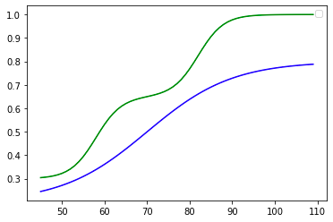
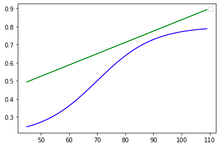
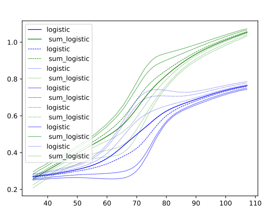

# Simulated cohorts

The goal of these simulated cohorts is to evaluate the capabilities of our model.
Things to investigate include :

- How the model handles the **number of patients** (minimum required to get a decent 
  average geodesic)
    
- How the model reacts to augmenting the **noise** : can it still recover the inflection
points or does it mix it the effects of the noise ?
  
- What is the influence of the amount of **visits per patients** : can the model recover
a complex average trajectory with only two or three years follow-up for patients ?
  
- Can the model recover **sub-populations** and disease sub-types ? For instance if we 
generate patients who we know have different trajectories based on where they stand in the 
  observation space, can the model recover those clusters ? (for instance  (typical, limbic predominant, hippocampal 
  sparing, and minimal atrophy))
  
- How does the model handle **non-monotonicity** of trajectories ?
- How well does the model recover the true **individual parameters** ?
- How well does the model **predict** future visits or **impute** missing data ?

To do so we simulated a bunch of cohorts of two different types : the trajectory-derived cohorts, and the 
metric-derived cohort. 

## Trajectory derived cohorts

For the first type, we just define reference trajectories (logistic, linear, sum of logistic,
weird asymptotes, etc) and apply the usual time reparametrization with 
individual parameters and use the spaceshift only as a 'relative time shift' between
features.

For the following studies we always used tau = 70±12years, xi = 0±0.5 and an age at baseline that 
is normally sample at 70±15 to be in a somewhat realistic setting. All visits are 6 months apart.

The first 3 cohorts are composed of a logistic curve going from 0.2 to 0.7 and a sum_of_logistic
curve from 0.3 to 1. The goal is to assess the reconstruction of asymptotes and multiple inflection points
that are badly accounted for in reference logistic models that go from 0 to 1.

- Simulated_data_1 : 100 patients with 5 visits each with 5% noise
- Simulated_data_2 : 200 patients with 10 visits each with 5% noise
- Simulated_data_3 : 200 patients with 10 visits each with 2% noise
- Simulated_data_4 : 100 patients with 5 visits each with 2% noise

- Simulated_data_7 : 150 patients with 12 visits each with 2.5% noise sum_log from .4 to 1

Then we simulated a combination of logistic and linear features with the following reference trajectories

- Simulated_data_5 : 100 patients with 5 visits each with 3% noise
- Simulated_data_6 : 200 patients with 10 visits each with 3% noise

## Metric derived cohorts

The downside of the latter approach is that is does not correspond exactly to the
Riemannian modeling so to benchmark our model we also want to recover a dynamic that is 
extracted from the exact same modeling. That means we want to generate longitudinal data that
arises from a mixed effect model in a Riemannian setting. To do so we take a reference metric, 
a family of individual parameters (tau, xi and spaceshift) and evaluate the reconstruction error.

:TODO:

## Results 

For each simulation we show the reconstructed average geodesic and variations (effect of the
spaceshifts) and some metrics.

- Simulated_data_3 

:TODO:
